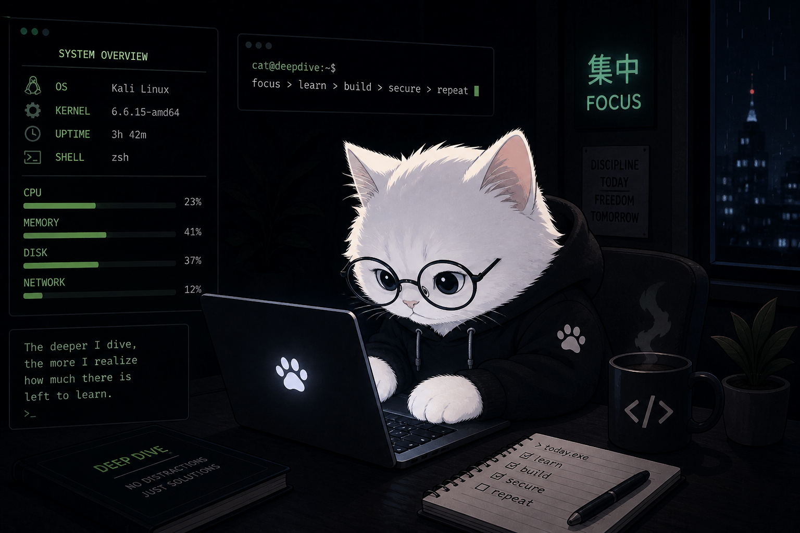

<h1 align="center">( o.o )   30 Days. 30 Projects.</h1>

<p align="center">
  <b>If you want to get hired — follow this repo as I build it.</b>
</p>

<p align="center">
  
  
  
  
</p>

---
<p align="center">
  
</p>


# If you want to get hired, stop just studying. Start building.

Every recruiter says the same thing — *"show me what you've built."*

Most CS students have nothing to show.

This repo fixes that. I'm building 30 real projects in 30 days — Python, Cybersecurity, Web Dev, Java — completely in public. Every line of code is here. Every project is yours to learn from, fork, and use.

Follow along. Build with me. Show up to your next interview with something real.

---

## 💼 These Projects Get You Into

| Track | Jobs |
|---|---|
| 🐍 Python | Python Dev · Backend Dev · Automation Engineer |
| 🔐 Cybersecurity | Pentester · Security Analyst · Bug Bounty Hunter |
| 🌐 Web Dev | Frontend Dev · Full Stack Dev · Freelancer |
| ☕ Java | Java Developer · Backend Engineer · Android Developer |

---

## 🛠️ Tools Used

**Python** — Python 3.10+, BeautifulSoup, Requests, Selenium, Telegram Bot API

**Cybersecurity** — Burp Suite, OWASP tools, Nmap, Shodan API

**Web Dev** — HTML/CSS/JS, React, Tailwind CSS

**Java** — Java 17+, Spring Boot, Maven

---

## 📁 How It's Organised

Each day has its own folder with the code and a short README.

```
30-days-30-projects/
├── day-01/
│   ├── main.py
│   └── README.md
├── day-02/
│   ├── main.py
│   └── README.md
└── ...
```

---

## ⚠️ Cybersecurity Projects

All security projects are for learning only — tested on my own systems and platforms like HackTheBox and TryHackMe.

Only use these on systems you own or have permission to test.

---

## 📈 Progress

```
Day  1 ░░░░░░░░░░░░░░░░░░░░░░░░░░░░░░  0/30 complete
```

---

## ⭐ Why Follow This?

Every project comes with a full Twitter breakdown — what I built, how I built it, and what I'd do differently. You get 30 projects worth of learning for free, built live in front of you.

Star the repo. You'll know the moment something new drops.

Follow the build: [@PratikS94864459](https://twitter.com/PratikS94864459)

---

<p align="center">
  <b>CoderCat 🐱 · Building in public · No shortcuts</b>
</p>
